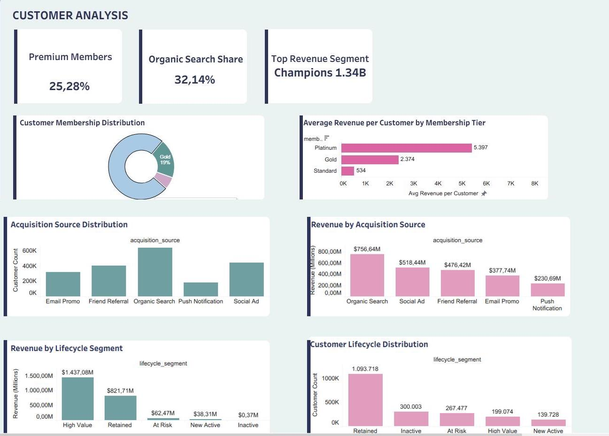

# Müşteri Analizi

=== "İçgörüler"

    !!! note "İş özeti"

        Müşteri analizi; üyelik katmanları, edinim kanalları, müşteri yaşam döngüsü ve değer yoğunlaşmasını birlikte değerlendirir.

    ## İş İçgörüleri

    - Müşteri değeri her segmentte eşit dağılmaz; yüksek değerli gruplar retention önceliği taşır.
    - Edinim kanalları ve üyelik katmanları, müşteri kalitesi ve uzun vadeli katkı açısından birlikte izlenmelidir.
    - Bu analizde ayrı bir tahmine dayalı modelleme notebooku kullanılmamıştır; bulgular dbt martları ve Tableau görselleri üzerinden üretilmiştir.

=== "Pipeline"

    Analiz, müşteri profili, işlem geçmişi, üyelik bilgisi ve segment metriklerini hazırlayan dbt modellerinden beslenir. Final çıktılar Tableau dashboardu için müşteri düzeyi ve segment düzeyi görünüm sağlar.
