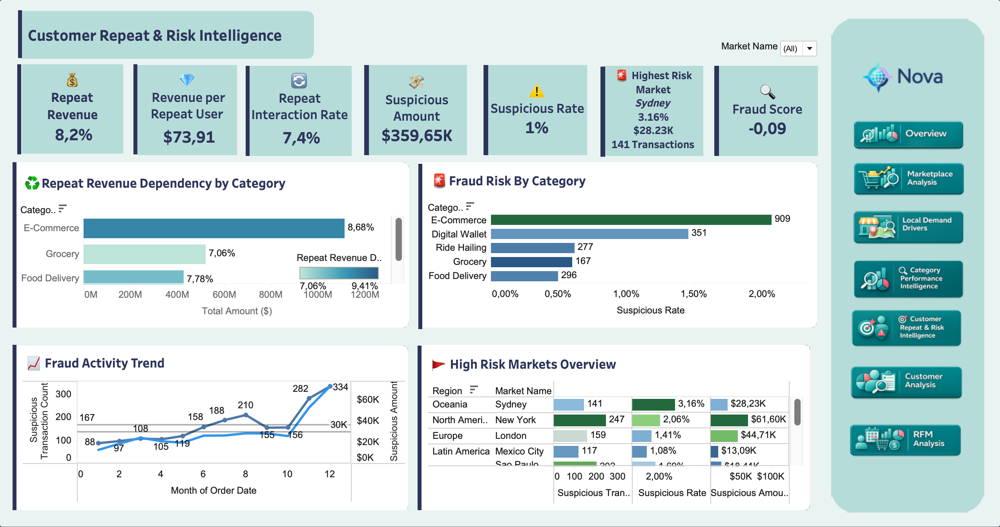

# Müşteri Tekrarı ve Risk

=== "İçgörüler"

    Customer Repeat & Risk Intelligence, sadakat sinyallerini işlem anomalisi izleme ile birleştirir. İş hikayesi dengelidir: tekrar davranışı anlamlı değer katkısı yapar, ancak henüz pazaryerinin baskın motoru değildir; şüpheli aktivite düşük oranlıdır, fakat hedefli inceleme gerektirecek kadar yoğunlaşmıştır.

    !!! abstract "Ana çıkarım"

        Nova, tekrar davranışını büyütürken şüpheli aktivitenin en fazla yoğunlaştığı kategori ve pazarları korumalıdır. Retention ve risk izleme birlikte yönetilmelidir.

    ## Temel Bulgular

    | Bulgu | Metrik | Yorum |
    | --- | --- | --- |
    | Tekrar davranışı anlamlı ama baskın değil | **%8.2 repeat revenue share**, **%7.4 repeat interaction rate** | Nova'nın büyütebileceği tekrar müşteri değeri var, ancak pazaryeri henüz repeat-led değil |
    | Tekrar müşterileri ölçülebilir değer taşıyor | **Repeat user başına $73.91 gelir** | Retention çalışması doğru kategorilere hedeflenirse müşteri ekonomisini iyileştirebilir |
    | E-Commerce en güçlü repeat bağımlılığına sahip | **%8.68 repeat revenue share** | En büyük değer kategorisinde retention en büyük finansal upside'a sahip |
    | Şüpheli aktivite düşük oranlı | **%1.0 suspicious rate**, **$359.65K suspicious amount** | Sinyal geniş platform arızası değil, ancak inceleme iş akışları için yeterince büyük |
    | E-Commerce en yüksek şüpheli kategori hacmine sahip | Yaklaşık **909 şüpheli işlem**, yaklaşık **%2.1 suspicious rate** | Fraud kontrolleri değer ve şüpheli aktivitenin çakıştığı yerden başlamalı |
    | Pazar riski oran ve exposure'a göre değişiyor | Sydney: **%3.16 suspicious rate**, 141 işlem, $28.23K; New York: 247 işlem, $61.60K | Sydney oran bazlı inceleme gerektirirken New York daha büyük değer exposure'ına sahip |

    ## İş İçgörüleri

    Tekrar davranışı bir fırsattır, çözülmüş bir avantaj değildir. Dashboard, repeat user'ların gerçek bir değer payı yarattığını gösterir; ancak işlem değerinin çoğu hala tekrar olmayan davranıştan gelir. Bu da E-Commerce'i en net retention önceliği yapar, çünkü en büyük değer tabanını en güçlü repeat-revenue bağımlılığıyla birleştirir.

    Şüpheli aktivite, genel bir fraud iddiası olarak değil, odaklı inceleme kuyruğu olarak ele alınmalıdır. Model anomalileri işaretler; en yüksek öncelikli alanlar şüpheli yoğunlaşma ile iş exposure'ının çakıştığı yerlerdir: kategori olarak E-Commerce, suspicious rate açısından Sydney ve suspicious value açısından New York.

    Aktivite trendi de önemlidir. Şüpheli işlem sayıları yıl sonuna doğru yükselir; bu da izleme eşiklerinin ve inceleme kapasitesinin statik dashboard metriği gibi değil, zaman içinde kontrol edilmesi gerektiğini gösterir.

    !!! warning "Yorum"

        Şüpheli işlemler model tarafından üretilmiş anomali adaylarıdır, doğrulanmış fraud değildir. Yüksek riskli pazar otomatik olarak kötü pazar anlamına gelmez; Nova'nın örüntüleri incelemesi, kontrolleri ayarlaması ve review önceliği vermesi gereken yerdir.

=== "Yöntem"

    Bu sayfa repeat-behavior dbt modellemesi ile Python'da oluşturulmuş denetimsiz fraud anomali modelini birleştirir.

    ## Tekrar Davranışı Pipeline'ı

    | Model | Grain | Rol |
    | --- | --- | --- |
    | `int_user_service_repeat_behavior` | user + service | Repeat interaction ve user-service değerini sayar |
    | `mart_service_repeat_behavior` | service | Repeat users, repeat interactions, repeat revenue ve repeat amount share metriklerini agregeler |

    ## Fraud Modelleme Pipeline'ı

    | Adım | Çıktı | Rol |
    | --- | --- | --- |
    | Feature engineering | `ml_transaction_fraud_features` | Anomali tespiti için işlem seviyesi davranış özellikleri üretir |
    | Notebook modeli | `notebooks/fraud_detection_isolation_forest.ipynb` | scikit-learn ile Isolation Forest modeli eğitir |
    | Model çıktısı | `ml_transaction_fraud_scores_sample` | Anomali skorlarını ve suspicious flag'leri BigQuery'de saklar |
    | Tableau martı | `mart_transaction_fraud_tableau` | Skorları işlem, müşteri, servis ve pazar bağlamına geri bağlar |

    Model; işlem tutarı, işlem zamanlaması, kullanıcı hızı, 24 saatlik harcama, önceki harcama davranışı, pazarlar arası aktivite, servisler arası aktivite, gece geç saat davranışı, başarısız işlemler ve refund işlemlerini kullanır.

    !!! warning "Modelleme notu"

        Kaynak veride etiketlenmiş fraud sonucu yoktur. Isolation Forest modeli inceleme için anomalili işlemleri işaretler; fraud'u kanıtlamaz.
