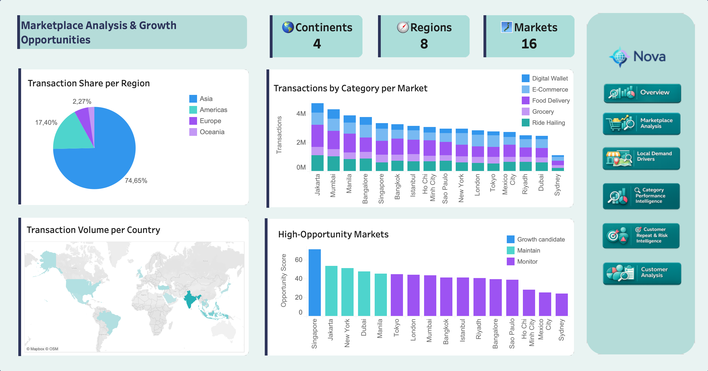

# Pazaryeri Analizi ve Büyüme Fırsatları

=== "İçgörüler"

    !!! note "İş özeti"

        Nova, **4 kıta**, **8 bölge** ve **16 şehir pazarında** faaliyet gösterir. Kullanımın büyük bölümü Asya'da yoğunlaşır; Hindistan tek başına işlem hacminin yaklaşık beşte birini taşır.

    ## İş İçgörüleri

    - Jakarta, Mumbai ve Manila gibi Güney ve Güneydoğu Asya pazarları güçlü işlem hacmi gösterir.
    - Singapur fırsat skorunda öne çıkar; dijitalleşmiş, kentli ve gelir seviyesi yüksek bir pazar profili sunar.
    - Daha zayıf pazarlar büyüme dışı değildir; ancak yatırım önceliği mevcut performans, büyüme oranı, servis arzı, kullanıcı tabanı ve makro sinyaller birlikte değerlendirilerek verilmelidir.

=== "Pipeline"

    Pazar analizi; etkileşimler, pazar boyutu, ülke metadatası, hava durumu ve makro göstergeleri birleştiren dbt modellerinden beslenir. Fırsat skoru, mevcut performans ve dış bağlam sinyallerini aynı analitik martta toplar.
