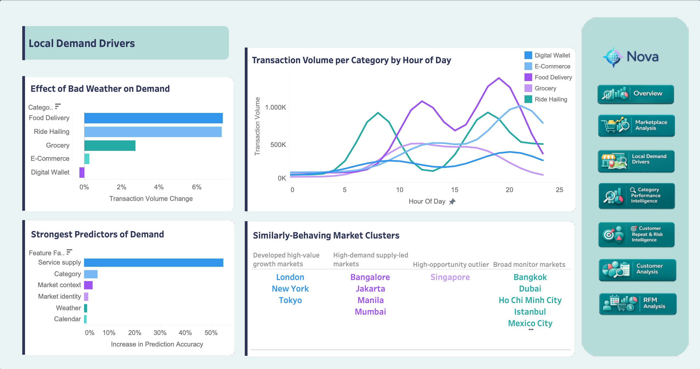

# Yerel Talep Etkenleri

=== "İçgörüler"

    İlk soru, yerel koşulların ve özellikle hava durumunun Nova talebini açıklamaya yardımcı olup olmadığıydı. Cevap evet; ancak ana hikaye hava durumu değil. Kötü hava bazı kategorilerde daha yüksek taleple ilişkilidir, fakat talep modeli en güçlü şekilde **servis arzını** en büyük tahmin edici özellik ailesi olarak gösterir.

    Daha sade ifadeyle: Nova talebi, pazaryerinde yeterli sayıda kaliteli servis bulunduğunda daha öngörülebilir görünüyor. Hava durumu özellikle Food Delivery ve Ride Hailing için operasyonel olarak önemlidir; ancak servis derinliği ve kalitesi daha stratejik büyüme kaldıracıdır.

    !!! abstract "Ana çıkarım"

        Hava durumu günlük talep hareketinin bir kısmını açıklar, ancak pazaryeri arzı daha güçlü iş sinyalidir. Talebi büyütmek için Nova önce servis kalitesi ve bulunabilirliğine odaklanmalı, ardından hava durumu ve saatlik örüntüleri operasyonel planlama için kullanmalıdır.

    ## Temel Bulgular

    | Bulgu | Metrik | Yorum |
    | --- | --- | --- |
    | Food Delivery kötü havada yükseliyor | **+%7.00 işlem artışı** | Yemek teslimatında hava duyarlı kolaylık talebi görünür |
    | Ride Hailing de kötü havada yükseliyor | **+%6.58 işlem artışı** | Seyahat zorlaştığında mobilite talebi artıyor |
    | Grocery değeri hava durumuna duyarlı | **+%10.25 GMV artışı** | İşlem artışı daha küçük olsa bile kötü hava sepet değerini artırabilir |
    | Digital Wallet hava durumuna daha az duyarlı | **-%0.84 işlem artışı** | Tamamen dijital aktivite yerel hava koşullarına daha az bağlıdır |
    | Servis arzı en güçlü tahmin edici özellik ailesi | Modelde en büyük feature-family önemine sahip | Aktif servisler, rating, popülerlik ve service-tier karışımı hava durumundan daha fazla talep varyasyonu açıklar |

    ## İş İçgörüleri

    Operasyonel çıkarım, kötü hava dönemlerinde Food Delivery ve Ride Hailing kapasitesini hazırlamaktır. Stratejik çıkarım daha geniştir: servis bulunabilirliğini ve kalitesini iyileştirmek, hava durumunu ana büyüme kaldıracı gibi ele almaktan daha uygulanabilir görünür.

    Saatlik davranış da aynı fikri destekler. Food Delivery öğün zamanlarında yoğunlaşır, Ride Hailing işe gidiş-geliş benzeri dönemlerde yükselir, diğer kategoriler ise daha stabildir. Bu, tek bir platform geneli talep kuralından ziyade kategoriye özel staffing, kampanya zamanlaması ve arz planlamasının daha etkili olacağını gösterir.

    Pazar kümelenmesi portföy bakışını ekler:

    | Küme | Pazarlar | Önerilen playbook |
    | --- | --- | --- |
    | Gelişmiş yüksek değerli büyüme pazarları | London, New York, Tokyo | Yüksek değerli büyüme ve güvenilirlik etrafında yönetin |
    | Yüksek talep, arz odaklı pazarlar | Bangalore, Jakarta, Manila, Mumbai | Servis arzını koruyun ve derinleştirin |
    | Yüksek fırsatlı ayrışan pazar | Singapore | Ayrı bir stratejik büyüme bahsi olarak ele alın |
    | Geniş izleme pazarları | Bangkok, Dubai, Ho Chi Minh City, Istanbul, Mexico City, Riyadh, Sao Paulo, Sydney | Agresif ölçeklemeden önce talep ve arz boşluklarını teşhis edin |

    !!! warning "Yorum"

        Feature importance nedensellik değil, tahmine dayalı ilişki gösterir. Model, servis eklemenin otomatik olarak talep büyümesine yol açtığını kanıtlamaz; ancak net bir iş sinyali verir: arz sağlığı hava durumu ve pazar bağlamıyla birlikte yönetilmelidir.

=== "Yöntem"

    Bu sayfa dbt feature engineering ile Python notebook modellemesini birleştirir. Tableau dashboardu final katmandır.

    ## dbt Feature Engineering

    | Mart | Grain | Rol |
    | --- | --- | --- |
    | `mart_geo_market_category_day_features` | market + category + date | Talep modellemesi ve hava durumu analizi için ana feature tablosu |
    | `mart_geo_weather_category_effects` | category, all-market ve market-level satırlarla | Kötü hava işlem ve GMV artışı |
    | `mart_geo_category_hourly_demand` | market + category + hour | Saatlik kategori talep eğrileri |
    | `mart_geo_market_cluster_features` | market | Pazar kümelenmesi için feature tablosu |

    Feature martı işlem agregasyonlarını, takvim alanlarını, pazar bağlamını, ülke makro göstergelerini, servis arzını ve günlük Open-Meteo hava durumunu eksiksiz bir market-category-day grid'inde birleştirir.

    ## Tahmine Dayalı Modelleme

    `notebooks/geo_demand_modeling.ipynb`, scikit-learn kullanarak günlük işlemleri modeller:

    | Adım | Uygulama |
    | --- | --- |
    | Hedef | market-category-day grain'inde `transactions` |
    | Bölme | Kronolojik train/validation bölmesi: Ocak-Ekim ve Kasım-Aralık 2024 |
    | Modeller | Market-category average baseline, Ridge regression, Random Forest regression |
    | Yorumlama | Feature ailelerine gruplanmış validation tabanlı permutation importance |
    | Çıktı | Feature importance ve feature-family importance tabloları BigQuery'ye geri yazıldı |

    ## Pazar Kümelenmesi

    `notebooks/geo_market_clustering.ipynb`, 16 pazarı stratejik arketiplere ayırmak için KMeans kullanır. Kümelenme; pazar ölçeği, GMV, büyüme, arz, güvenilirlik, makro bağlam, fırsat skorları, kategori karışımı ve hava duyarlılığını kullanır.

    !!! warning "Modelleme notu"

        Regresyon ve kümelenme çıktıları analiz ve hikayeleştirmeyi destekler. Bunlar production forecasting veya final operasyon kuralları değildir.
