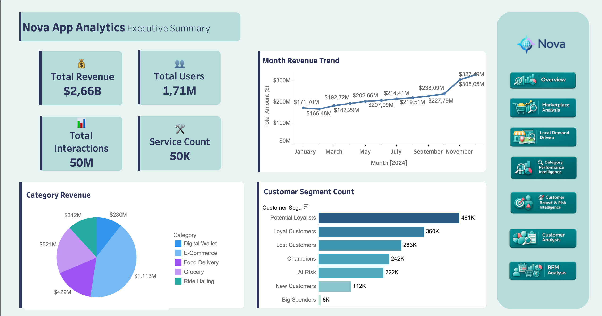

# Yönetici Özeti

=== "İçgörüler"

    !!! note "İş özeti"

        Nova, 2024 boyunca **$2.66B GMV**, **1.71M aktif kullanıcı**, **50M etkileşim** ve **50K servis** ölçeğine ulaştı. Bu sayfa, projenin ana iş bulgularını tek ekranda toplar.

    ## İş İçgörüleri

    - E-ticaret en büyük hacim alanı olarak öne çıkar ve toplam GMV'nin önemli bölümünü taşır.
    - Aktivite Asya pazarlarında yoğunlaşır; bu nedenle büyüme stratejisi pazar bazlı ele alınmalıdır.
    - Dashboard, pazar büyüklüğü, kategori katkısı, müşteri davranışı ve operasyonel risk göstergelerini birlikte okumak için bir başlangıç noktasıdır.

=== "Pipeline"

    Bu analiz, düzeltilmiş Nova veri setinden BigQuery'ye yüklenen kaynak tablolarla başlar. dbt staging modelleri kaynakları temizler, intermediate modeller ortak iş mantığını kurar, mart modelleri ise Tableau için analiz hazır tablolar üretir.

    Kullanılan temel çıktı türleri: pazaryeri KPI'ları, kategori özetleri, müşteri metrikleri, hizmet arzı göstergeleri ve risk/anomali sinyalleri.
