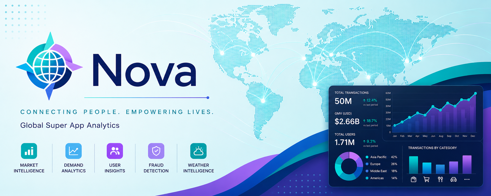

  

# Nova Analytics Projesi

Nova Analytics, global bir super-app pazaryeri veri seti üzerine kurulan uçtan uca bir analitik portföy projesidir. Veri setini daha gerçekçi hale getirmek için yeniden ürettik, BigQuery'ye yükledik, SQL sorguları ve dbt modelleriyle staging'den mart katmanına taşıdık, Python/Jupyter ile modelleme ve anomali analizi yaptık, bulguları Tableau dashboardları ve bu Zensical sitesiyle sunduk.

!!! abstract "Kısa özet"

    Proje; SQL sorgulama, dbt modelleme, BigQuery veri ambarı, Python analizi, Tableau dashboardları ve iş odaklı veri hikayeleştirmesini tek bir test edilmiş analitik pipeline içinde gösterir. Analizler pazaryeri ölçeği, talep etkenleri, kategori performansı, müşteri değeri, tekrar davranışı ve işlem riskini pratik önerilere bağlar.

## Projeye Hızlı Bakış

| Alan | Özet |
| --- | --- |
| Veri ölçeği | **50M etkileşim**, **1.71M aktif kullanıcı**, **50K servis** |
| Pazaryeri değeri | 2024 boyunca **$2.66B GMV** |
| Kapsam | **4 kıta**, **8 bölge** ve **16 şehir pazarı** |
| Analiz çıktısı | **7 Tableau destekli analiz sayfası** |
| Pipeline | yeniden üretilmiş veri seti, BigQuery, SQL, dbt staging/intermediate/marts, Python notebookları, Tableau |

## Analiz Portföyü

Her analiz sayfası bir iş sorusuna odaklanır ve Tableau dashboardunu arkasındaki veri pipeline'ıyla birlikte açıklar.

-   :lucide-layout-dashboard:{ .lg .middle } __[Yönetici Özeti](analizler/yonetici-ozeti.md)__

    ---

    Pazaryeri ölçeği, ana GMV göstergeleri, müşteri tabanı ve genel analitik pipeline.

    _Yazar: Doruk Alkan_

-   :lucide-map:{ .lg .middle } __[Pazaryeri Analizi](analizler/pazaryeri-analizi.md)__

    ---

    Bölgesel performans, pazar fırsatı skoru ve 16 pazar için büyüme önceliklendirmesi.

    _Yazar: Doruk Alkan_

-   :lucide-cloud-sun:{ .lg .middle } __[Yerel Talep Etkenleri](analizler/yerel-talep-etkenleri.md)__

    ---

    Hava durumu, servis arzı, zamanlama, talep modellemesi ve pazar profilleri.

    _Yazar: Doruk Alkan_

-   :lucide-chart-bar:{ .lg .middle } __[Kategori Performansı](analizler/kategori-performansi.md)__

    ---

    Kategori GMV'si, servis güvenilirliği, operasyonel risk ve büyümenin dengelenmesi gereken alanlar.

    _Yazar: Yasemen Nur Salım Dündar_

-   :lucide-shield-alert:{ .lg .middle } __[Müşteri Tekrarı ve Risk](analizler/musteri-tekrar-ve-risk.md)__

    ---

    Tekrar davranışı, şüpheli işlem örüntüleri, anomali skorlaması ve risk inceleme öncelikleri.

    _Yazar: Yasemen Nur Salım Dündar_

-   :lucide-user-round-check:{ .lg .middle } __[Müşteri Analizi](analizler/musteri-analizi.md)__

    ---

    Üyelik katmanları, edinim kanalları, yaşam döngüsü davranışı ve müşteri değeri yoğunlaşması.

    _Yazar: Merve Kaymaz_

-   :lucide-repeat:{ .lg .middle } __[RFM Analizi](analizler/rfm-analizi.md)__

    ---

    Recency, frequency ve monetary segmentasyonu; retention öncelikleri ve müşteri geliştirme fırsatları.

    _Yazar: Merve Kaymaz_

## dbt Modelleri

-   :lucide-sprout:{ .lg .middle } __[dbt Seeds](modeller/seeds.md)__

    ---

    Coğrafya, hava durumu ve makro bağlam için kullanılan dış zenginleştirme girdileri.

-   :lucide-arrows-up-from-line:{ .lg .middle } __[Staging Modelleri](modeller/staging.md)__

    ---

    Etkileşimler, kullanıcılar, servisler, pazarlar ve dış kaynaklar için temiz kaynak arayüzleri.

-   :lucide-package-open:{ .lg .middle } __[Intermediate Modeller](modeller/intermediate.md)__

    ---

    Talep, servis sağlığı, müşteri davranışı ve RFM skoru için yeniden kullanılabilir SQL iş mantığı.

-   :lucide-package-search:{ .lg .middle } __[Analitik Martlar](modeller/marts.md)__

    ---

    Analiz sayfalarında kullanılan Tableau ve notebook odaklı final modeller.

## Daha Fazla Bilgi

-   :lucide-database:{ .lg .middle } __[Veri Seti](hakkinda/veri-seti.md)__

    ---

    Kaynak veri seti, yeniden üretim gerekçesi, düzeltilmiş veri kapsamı ve proje içeriği.

-   :lucide-cloud-download:{ .lg .middle } __[API Kaynakları](hakkinda/api-kaynaklari.md)__

    ---

    Zenginleştirme için kullanılan dış hava durumu, ülke metadatası ve makroekonomik kaynaklar.

-   :lucide-users:{ .lg .middle } __[Ekip](hakkinda/ekip.md)__

    ---

    Analiz, modelleme, dashboard ve yazım sorumlulukları.

-   :fontawesome-brands-github:{ .lg .middle } __[GitHub Deposu](https://github.com/mmervekaymaz/nova-analytics)__

    ---

    Kaynak kod, SQL sorguları, dbt modelleri, notebooklar, dashboardlar ve site dosyaları.

