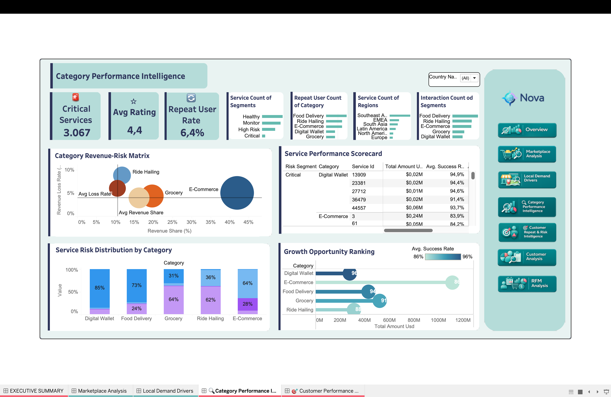

---
icon:
title:
description:
author:
---

# Category Performance Intelligence

## Overview

The Category Performance Intelligence dashboard provides a comprehensive view of category-level business performance by combining revenue contribution, service quality, operational risk, customer retention, and growth opportunity metrics.

The objective of this dashboard is to help decision makers identify:

•⁠  ⁠High-performing categories
•⁠  ⁠Revenue concentration risks
•⁠  ⁠Critical services requiring intervention
•⁠  ⁠Growth opportunities across categories
•⁠  ⁠Regional service distribution patterns

---

## Key Performance Indicators (KPIs)

### 🚨 Critical Services

Number of services classified as operationally critical based on performance and risk indicators.

*Business Value*

•⁠  ⁠Identifies services requiring immediate attention.
•⁠  ⁠Supports risk mitigation efforts.

---

### ⭐ Average Rating

Average customer rating across all services.

*Business Value*

•⁠  ⁠Measures customer satisfaction.
•⁠  ⁠Indicates service quality performance.

---

### 🔁 Repeat User Rate

Percentage of users who interact with the same service multiple times.

*Business Value*

•⁠  ⁠Measures customer loyalty.
•⁠  ⁠Indicates long-term service attractiveness.

---

## Visualizations

### Revenue-Risk Matrix

This bubble chart positions categories according to:

•⁠  ⁠Revenue Share (%)
•⁠  ⁠Revenue Loss Rate (%)
•⁠  ⁠Total Revenue (bubble size)

*Business Questions Answered*

•⁠  ⁠Which categories generate the largest revenue?
•⁠  ⁠Which categories carry the highest operational risk?
•⁠  ⁠Where is the business most dependent?

*Key Insight Example*

E-Commerce contributes the largest share of total revenue while simultaneously representing a major dependency risk.

---

### Service Performance Scorecard

A detailed service-level performance table including:

•⁠  ⁠Risk Segment
•⁠  ⁠Revenue
•⁠  ⁠Success Rate
•⁠  ⁠Refund Rate
•⁠  ⁠Failure Rate

*Business Questions Answered*

•⁠  ⁠Which services underperform?
•⁠  ⁠Which services require operational improvements?

---

### Service Risk Distribution by Category

Displays the distribution of services across different risk levels for each category.

*Business Questions Answered*

•⁠  ⁠Which categories contain the highest concentration of risky services?
•⁠  ⁠How balanced is the category portfolio?

---

### Growth Opportunity Ranking

Ranks categories using:

•⁠  ⁠Revenue Volume
•⁠  ⁠Success Rate

*Business Questions Answered*

•⁠  ⁠Which categories deserve additional investment?
•⁠  ⁠Which categories combine scale and operational excellence?

---

## Business Impact

This dashboard enables stakeholders to:

•⁠  ⁠Detect category-level operational risks.
•⁠  ⁠Monitor service quality performance.
•⁠  ⁠Prioritize investments.
•⁠  ⁠Reduce revenue concentration risk.
•⁠  ⁠Identify scalable growth opportunities.

---

# Customer Repeat & Risk Intelligence

## Overview

The Customer Repeat & Risk Intelligence dashboard combines customer retention analytics with fraud risk monitoring.

The goal is to understand:

•⁠  ⁠Customer loyalty behavior
•⁠  ⁠Repeat purchase dependency
•⁠  ⁠Fraud and anomaly patterns
•⁠  ⁠Market-level risk concentration
•⁠  ⁠Transaction anomalies over time

---

## Fraud Detection Methodology

An unsupervised anomaly detection framework was implemented using the Isolation Forest algorithm.

Since no labeled fraud data was available, anomaly detection was used instead of supervised classification.

### Features Used

The model evaluates transaction behavior using:

•⁠  ⁠Transaction amount
•⁠  ⁠Transaction hour
•⁠  ⁠Transaction frequency (1 hour / 24 hours)
•⁠  ⁠User spending in previous 24 hours
•⁠  ⁠Difference from historical spending behavior
•⁠  ⁠Cross-market activity
•⁠  ⁠Cross-service activity
•⁠  ⁠Night-time transactions
•⁠  ⁠Failed transactions
•⁠  ⁠Refunded transactions

### Model Output

The model generates a:

*Fraud Anomaly Score*

Higher scores indicate increasingly abnormal transaction behavior and higher fraud risk.

---

## Key Performance Indicators (KPIs)

### 💰 Repeat Revenue Share

Percentage of total revenue generated by repeat customers.

*Business Value*

•⁠  ⁠Measures revenue sustainability.
•⁠  ⁠Indicates customer loyalty impact.

---

### 💎 Revenue per Repeat User

Average revenue generated by each repeat customer.

*Business Value*

•⁠  ⁠Evaluates customer lifetime value potential.

---

### 🔁 Repeat Interaction Rate

Percentage of repeated interactions.

*Business Value*

•⁠  ⁠Measures customer engagement.

---

### 💵 Suspicious Amount

Total monetary value of transactions flagged as suspicious.

*Business Value*

•⁠  ⁠Quantifies financial exposure.

---

### ⚠️ Suspicious Rate

Percentage of suspicious transactions.

*Business Value*

•⁠  ⁠Tracks overall fraud risk level.

---

### 🚩 Highest Risk Market

Market with the highest fraud concentration.

*Business Value*

•⁠  ⁠Supports targeted fraud monitoring.

---

### 🔎 Fraud Score

Overall anomaly score generated by the fraud detection model.

*Business Value*

•⁠  ⁠Provides a consolidated risk indicator.

---

## Visualizations

### Repeat Revenue Dependency by Category

Measures how dependent each category is on repeat customer revenue.

*Business Questions Answered*

•⁠  ⁠Which categories rely most heavily on customer loyalty?
•⁠  ⁠Where should retention programs be prioritized?

---

### Fraud Risk by Category

Ranks categories based on suspicious transaction volume.

*Business Questions Answered*

•⁠  ⁠Which categories require stronger fraud controls?
•⁠  ⁠Where should fraud prevention efforts be concentrated?

---

### Fraud Activity Trend

Tracks suspicious transaction activity over time.

*Business Questions Answered*

•⁠  ⁠Are fraud risks increasing?
•⁠  ⁠Which periods show abnormal behavior spikes?

---

### High-Risk Markets Overview

Provides a regional and market-level fraud breakdown.

Metrics include:

•⁠  ⁠Suspicious Transaction Count
•⁠  ⁠Suspicious Rate
•⁠  ⁠Suspicious Amount

*Business Questions Answered*

•⁠  ⁠Which markets present the greatest fraud risk?
•⁠  ⁠Where should investigation efforts be prioritized?

---

## Business Impact

This dashboard helps organizations:

•⁠  ⁠Improve customer retention strategies.
•⁠  ⁠Identify revenue generated by loyal customers.
•⁠  ⁠Detect anomalous transaction patterns.
•⁠  ⁠Monitor fraud exposure in real time.
•⁠  ⁠Prioritize investigations and risk mitigation efforts.

Together, the Category Performance Intelligence and Customer Repeat & Risk Intelligence dashboards provide a balanced view of growth, customer behavior, operational performance, and fraud risk across the Nova ecosystem.