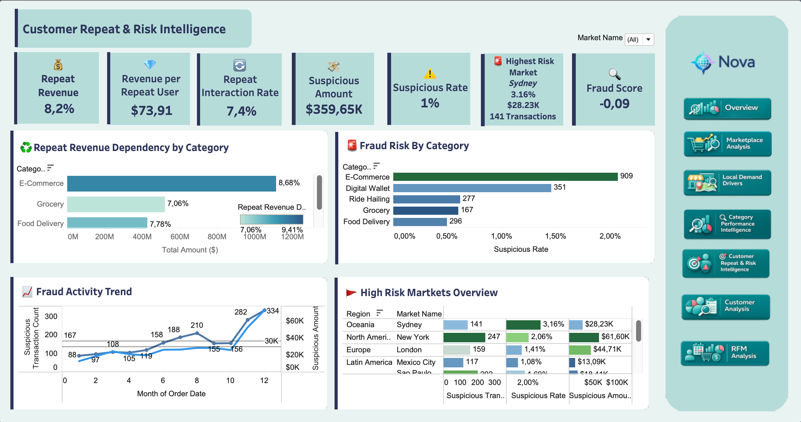

# Customer Repeat & Risk Intelligence

=== "Insights"

    

    Customer Repeat & Risk Intelligence connects customer retention analytics with fraud-risk monitoring. It shows where Nova depends on repeat behavior, where suspicious activity appears, and which markets or categories need closer review.

    !!! abstract "What this page answers"

        - Which categories rely most on repeat customers?
        - How much revenue comes from repeat behavior?
        - Where are suspicious transactions concentrated?
        - Which markets should be prioritized for risk monitoring?

    ## KPI Cards

    | KPI | What it shows | Why it matters |
    | --- | --- | --- |
    | Repeat Revenue Share | Share of revenue generated by repeat customers | Measures revenue sustainability |
    | Revenue per Repeat User | Average revenue from each repeat customer | Indicates repeat-customer value |
    | Repeat Interaction Rate | Share of interactions that come from repeat behavior | Tracks engagement depth |
    | Suspicious Amount | Total value of suspicious transactions | Quantifies financial exposure |
    | Suspicious Rate | Share of transactions flagged as suspicious | Tracks fraud-risk level |
    | Highest Risk Market | Market with the highest fraud concentration | Guides targeted monitoring |
    | Fraud Score | Model-generated anomaly score | Provides a consolidated risk indicator |

    ## Dashboard Views

    | View | What it shows | Business use |
    | --- | --- | --- |
    | Repeat Revenue Dependency | Categories most dependent on repeat customers | Identifies where retention has the highest revenue impact |
    | Fraud Risk by Category | Suspicious transaction volume and amount by category | Prioritizes fraud controls |
    | Fraud Activity Trend | Suspicious activity over time | Spots periods of elevated anomaly activity |
    | High-Risk Markets Overview | Suspicious count, rate, and amount by market | Guides targeted investigation |

    !!! warning "Interpretation"

        A high-risk market is not automatically a bad market. It means the market deserves closer investigation, tighter monitoring, or more targeted fraud controls.

=== "Method"

    This page combines repeat-behavior dbt modeling with an unsupervised fraud anomaly model built in Python.

    ## Repeat Behavior Pipeline

    | Model | Grain | Role |
    | --- | --- | --- |
    | `int_user_service_repeat_behavior` | user + service | Counts repeat interactions and user-service value |
    | `mart_service_repeat_behavior` | service | Aggregates repeat users, repeat interactions, repeat revenue, and repeat amount share |

    ## Fraud Modeling Pipeline

    | Step | Artifact | Role |
    | --- | --- | --- |
    | Feature engineering | `ml_transaction_fraud_features` | Builds transaction-level behavioral features for anomaly detection |
    | Notebook model | `notebooks/fraud_detection_isolation_forest.ipynb` | Trains an Isolation Forest model with scikit-learn |
    | Model output | `ml_transaction_fraud_scores_sample` | Stores anomaly scores and suspicious flags in BigQuery |
    | Tableau mart | `mart_transaction_fraud_tableau` | Joins scores back to transaction, customer, service, and market context |

    The model uses transaction amount, transaction timing, user velocity, 24-hour spending, prior spending behavior, cross-market activity, cross-service activity, late-night behavior, failed transactions, and refunded transactions.

    !!! warning "Modeling caveat"

        The source data has no labeled fraud outcome. The Isolation Forest model flags anomalous transactions for review; it does not prove fraud.
