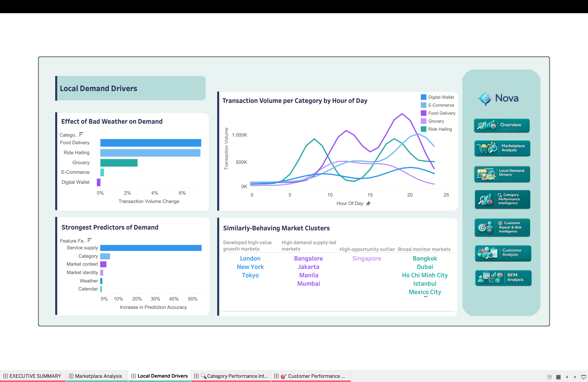

# Local Demand Drivers

=== "Insights"

    

    The initial question was whether local conditions, especially weather, help explain Nova demand. The answer is yes, but weather is not the main story. Bad weather is associated with higher demand in some categories, but the demand model points more strongly to **service supply** as the largest predictor family.

    In plain terms: Nova demand appears most predictable where the marketplace has enough high-quality services available. Weather still matters for operations, especially Food Delivery and Ride Hailing, but service depth and quality are the more strategic growth lever.

    !!! abstract "Key takeaway"

        Weather explains some daily demand movement, but marketplace supply is the stronger business signal. To grow demand, Nova should focus on service quality and availability, then use weather and hourly patterns for operational planning.

    ## Key Findings

    | Finding | Metric | Interpretation |
    | --- | --- | --- |
    | Food Delivery rises in bad weather | **+7.00% transaction lift** | Weather-sensitive convenience demand is visible in meal delivery |
    | Ride Hailing also rises in bad weather | **+6.58% transaction lift** | Mobility demand increases when conditions make travel harder |
    | Grocery value is weather-sensitive | **+10.25% GMV lift** | Bad weather can increase basket value even when transaction lift is smaller |
    | Digital Wallet is less weather-sensitive | **-0.84% transaction lift** | Purely digital activity is less tied to local weather conditions |
    | Service supply is the strongest predictor family | Largest feature-family importance in the model | Active services, ratings, popularity, and service-tier mix explain more demand variation than weather alone |

    ## Business Insights

    The operational takeaway is to prepare Food Delivery and Ride Hailing capacity around bad-weather periods. The strategic takeaway is broader: improving service availability and quality is more actionable than treating weather as the core growth lever.

    Hourly behavior supports the same idea. Food Delivery concentrates around meal windows, Ride Hailing rises around commute-like periods, and other categories are steadier. This suggests category-specific staffing, campaign timing, and supply planning should be more effective than a single platform-wide demand rule.

    The market clustering adds the portfolio lens:

    | Cluster | Markets | Recommended playbook |
    | --- | --- | --- |
    | Developed high-value growth markets | London, New York, Tokyo | Manage around high-value growth and reliability |
    | High-demand supply-led markets | Bangalore, Jakarta, Manila, Mumbai | Protect and deepen service supply |
    | High-opportunity outlier | Singapore | Treat as a separate strategic growth bet |
    | Broad monitor markets | Bangkok, Dubai, Ho Chi Minh City, Istanbul, Mexico City, Riyadh, Sao Paulo, Sydney | Diagnose demand and supply gaps before aggressive scaling |

    !!! warning "Interpretation"

        Feature importance shows predictive association, not causality. The model does not prove that adding services automatically causes demand growth, but it gives a clear business signal: supply health should be managed alongside weather and market context.

=== "Method"

    This page combines dbt feature engineering with Python modeling in notebooks. The Tableau dashboard is the final layer.

    ## dbt Feature Engineering

    | Mart | Grain | Role |
    | --- | --- | --- |
    | `mart_geo_market_category_day_features` | market + category + date | Main feature table for demand modeling and weather analysis |
    | `mart_geo_weather_category_effects` | category, with all-market and market-level rows | Bad-weather transaction and GMV lift |
    | `mart_geo_category_hourly_demand` | market + category + hour | Hourly category demand curves |
    | `mart_geo_market_cluster_features` | market | Feature table for market clustering |

    The feature mart joins transaction aggregates, calendar fields, market context, country macro indicators, service supply, and daily Open-Meteo weather into a complete market-category-day grid.

    ## Predictive Modeling

    `notebooks/geo_demand_modeling.ipynb` models daily transactions using scikit-learn:

    | Step | Implementation |
    | --- | --- |
    | Target | `transactions` at market-category-day grain |
    | Split | Chronological train/validation split: January-October vs November-December 2024 |
    | Models | Market-category average baseline, Ridge regression, Random Forest regression |
    | Interpretation | Validation-based permutation importance grouped into feature families |
    | Output | Feature importance and feature-family importance tables written back to BigQuery |

    ## Market Clustering

    `notebooks/geo_market_clustering.ipynb` uses KMeans to group the 16 markets into strategic archetypes. The clustering uses market scale, GMV, growth, supply, reliability, macro context, opportunity scores, category mix, and weather sensitivity.

    !!! warning "Modeling caveat"

        The regression and clustering outputs support analysis and storytelling. They are not production forecasting or final operating rules.
