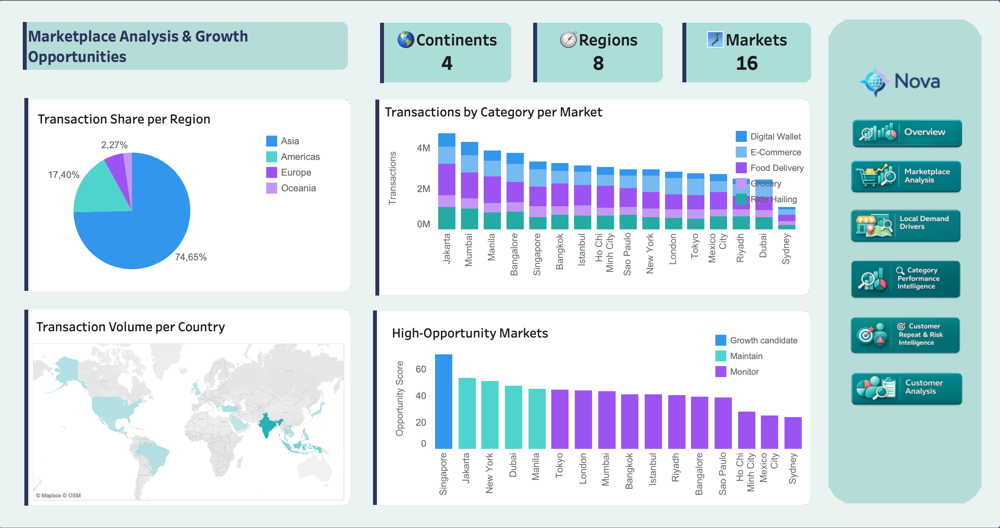

# Marketplace Analysis & Growth Opportunities

=== "Insights"

    Nova's marketplace footprint spans **4 continents**, **8 regions**, and **16 city markets**. The footprint is global, but usage is highly concentrated: **Asia accounts for 74.65% of transactions** and roughly **69.6% of GMV**.

    The strongest transaction markets are clustered in South and Southeast Asia. **Jakarta ranks first**, followed by **Mumbai**, **Manila**, **Bangalore**, and **Singapore**. Istanbul ranks **7th**, while Sydney is the smallest market by transaction count.

    !!! abstract "Key takeaway"

        Nova's growth story is market-led. South and Southeast Asia carry the demand base, while Singapore stands out as the clearest strategic opportunity market.

    ## Key Findings

    | Finding | Metric | Interpretation |
    | --- | --- | --- |
    | Asia dominates marketplace activity | **74.65% of transactions**, about **69.6% of GMV** | Nova's core operating strength is concentrated in Asian markets |
    | India is the largest country footprint | **16.14% of transactions** | India is the biggest country-level demand base across Mumbai and Bangalore |
    | Top markets are South/Southeast Asian | Jakarta, Mumbai, Manila, Bangalore, Singapore | The highest-volume markets are concentrated in nearby growth regions |
    | Singapore ranks first in opportunity | Highest opportunity score in the dashboard | Strong macro/digital context makes Singapore a strategic growth candidate |
    | Sydney is the smallest market | Lowest transaction count among the 16 markets | Lower-volume markets should be diagnosed before applying aggressive growth playbooks |

    ## Business Insights

    Nova should not use one global growth playbook. High-volume markets like Jakarta, Mumbai, Manila, and Bangalore need supply protection and operational consistency. Singapore deserves separate strategic attention because it combines strong opportunity scoring with a premium, highly digital market context.

    For broader monitor markets, the priority is diagnosis: understand whether growth is limited by demand, service supply, reliability, or local market context before scaling investment.

    !!! success "Recommendation"

        Prioritize Southeast Asia and Singapore as the clearest growth story, while using market-specific playbooks for high-volume, mature, and lower-supply markets.

=== "Method"

    This analysis is built from Nova transaction data enriched with external geography, weather, and macroeconomic context.

    ## Data Enrichment

    | Source | Role in the analysis | Seed artifact |
    | --- | --- | --- |
    | Reviewed market-country lookup | Connects Nova city markets to country identifiers | `market_country_lookup.csv` |
    | REST Countries | Adds country metadata such as region, subregion, currency, capital, and timezone | `ext_country_metadata.csv` |
    | World Bank | Adds macro indicators such as population, GDP per capita, urbanization, internet usage, and mobile subscriptions | `ext_world_bank_indicators.csv` |
    | Open-Meteo | Adds daily weather context used elsewhere in the geography analysis | `ext_weather_daily.csv` |

    ## dbt Model Flow

    | Layer | Models | Purpose |
    | --- | --- | --- |
    | Staging | `stg_geo_market_country_lookup`, `stg_geo_country_metadata`, `stg_geo_world_bank_indicators`, `stg_markets`, `stg_interactions` | Standardize raw and seed inputs |
    | Intermediate | `int_geo_country_macro_pivot`, `int_geo_market_context`, `int_geo_market_day_metrics`, `int_geo_service_supply_by_market_category` | Create one-row-per-country, market context, market-day performance, and service supply features |
    | Mart | `mart_geo_market_opportunity` | Calculates market opportunity score, rank, and opportunity segment |

    ## Opportunity Score

    The opportunity mart combines current performance, macro potential, service supply, and adoption signals into a 0-100 score. The score is not a forecast; it is a structured prioritization metric for comparing the 16 Nova markets.

    !!! warning "Interpretation"

        Opportunity scoring is useful for ranking and discussion, but it should be treated as a decision-support metric. It does not replace market-specific business review.
